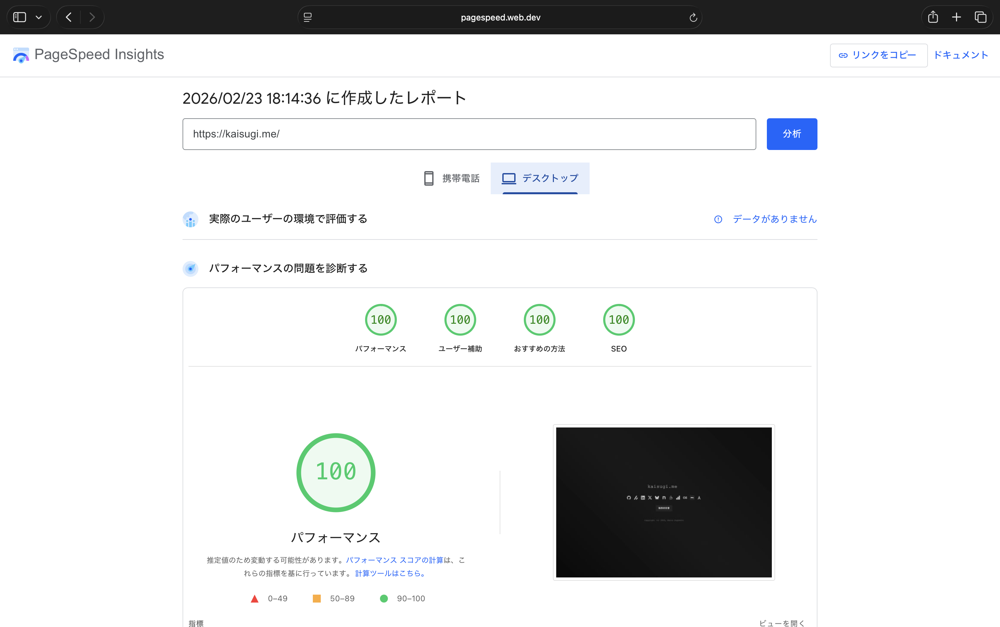
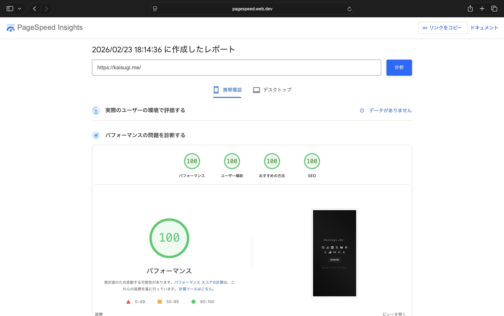

# kaisugi.me

> Personal portfolio site — blazingly fast, zero dependencies.

<!-- TODO: Add site preview screenshot -->
<!--  -->

## Features

- Pure HTML — no frameworks, no build step
- Near-perfect PageSpeed Insights scores
- Responsive, accessible, cyberpunk-inspired dark theme
- SEO-optimized with structured data, sitemap, and meta tags

## Performance

<!-- TODO: Add PageSpeed Insights screenshots -->
<!--  -->
<!--  -->

- Near-perfect scores across all categories — as of Feb 2026

## Inspired Projects

The design of this site has been adopted by others:

- [emmanuellfc.github.io](https://github.com/emmanuellfc/emmanuellfc.github.io)

## Tech Stack

- HTML5
- Hosted on [Cloudflare Pages](https://pages.cloudflare.com/)

## License

[Unlicense](./LICENSE)
